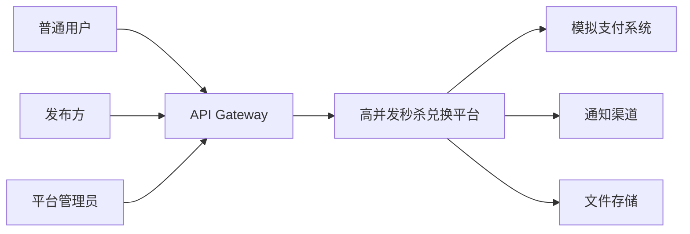
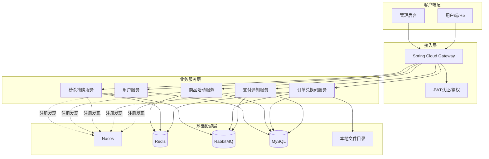
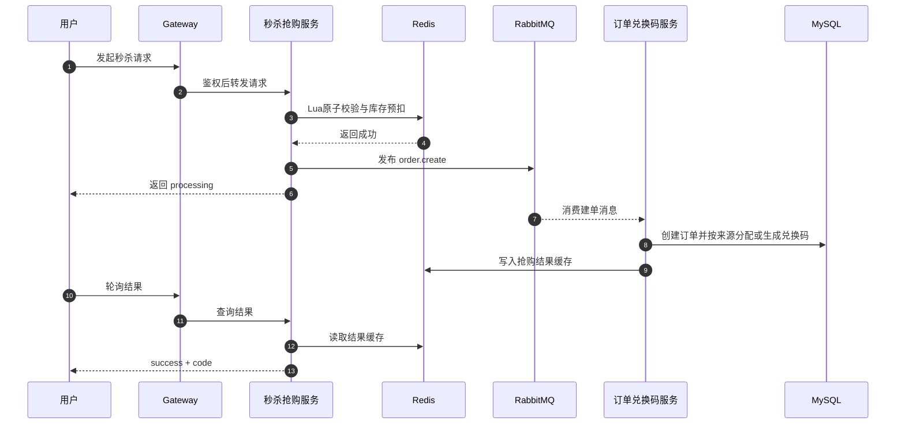
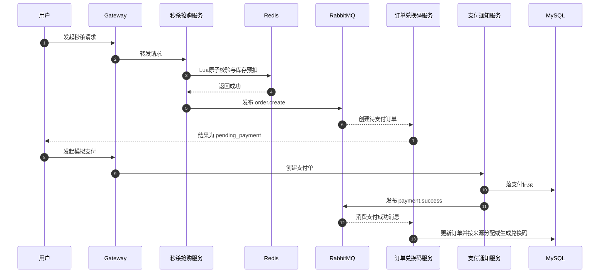
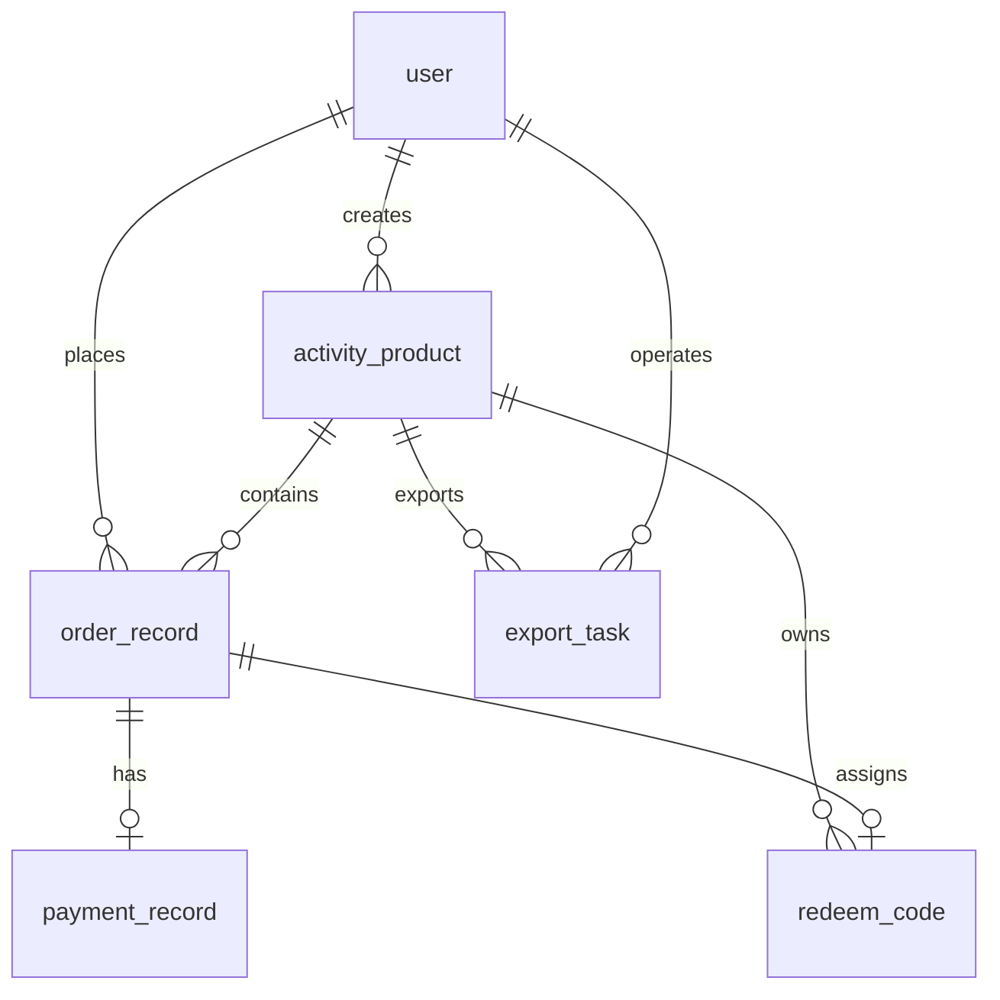

# 高并发秒杀兑换平台功能需求与技术架构文档

> 文档版本：v1.0  
> 编制日期：2026-04-14  
> 文档性质：功能需求与技术架构说明  
> 适用项目：高并发秒杀兑换平台  
> 编写依据：`高并发秒杀兑换平台设计文档.md`

## 1. 文档概述

### 1.1 建设背景

高并发秒杀兑换平台面向兑换码、虚拟权益、礼品卡、课程码、实物抢购资格等高并发发放场景，提供活动配置、库存预热、秒杀抢购、订单处理、支付通知、兑换码发放、结果查询和数据导出能力。平台建设重点在于：

- 承接活动开始瞬间的高并发请求，避免数据库被热点流量直接击穿。
- 支持免费抢购和支付后发码两种业务模式。
- 支持一人一买与一人多买两种限购策略。
- 支持商家按活动选择系统自动生成兑换码或导入第三方平台兑换码，完成自动发码、结果查询与导出闭环。
- 通过 Redis、RabbitMQ 和微服务拆分实现削峰、解耦、幂等与可扩展。

### 1.2 建设目标

- 建设统一的秒杀入口，保证活动高峰期具备稳定响应能力。
- 建设标准化活动配置能力，支持发布方快速创建活动、立即发布或定时发布，并支持活动预告展示。
- 建立从抢购资格、订单、支付到发码的完整业务闭环。
- 建立可观测、可补偿、可追踪的高并发业务链路。
- 为后续接入真实支付、风控、可配置兑换码生成规则等能力预留扩展空间。

### 1.3 适用范围

本文档适用于以下场景：

- 项目立项、课程设计、系统方案评审和研发实现说明。
- 需求拆解、接口联调、数据库建模、缓存和消息方案设计。
- 功能测试、并发测试、验收测试和技术答辩准备。

本文档不包含以下内容：

- 真实微信支付、支付宝等外部支付渠道对接细节。
- 多租户计费、商家结算、复杂营销和推荐系统。
- 物流履约、售后退款、客服工单等外围系统能力。

### 1.4 业务角色

| 角色 | 职责说明 |
| --- | --- |
| 平台管理员 | 维护用户、审核活动、监控平台运行状态、查看导出任务和异常记录。 |
| 发布方 | 创建活动、配置规则、选择兑换码来源、设置立即发布或定时发布、导入第三方平台兑换码、查看订单与发码结果、发起导出。 |
| 普通用户 | 登录、查看活动、参与秒杀、支付订单、查询兑换码。 |
| 支付系统 | 提供模拟支付下单、支付回调和支付结果通知。 |
| 通知系统 | 向用户发送抢购结果、支付成功和发码成功等通知。 |

## 2. 功能需求

### 2.1 业务流程概述

平台支持两条核心业务流程。

#### 2.1.1 免费抢购流程

1. 发布方创建活动，选择兑换码来源，并配置立即发布或定时发布策略；若选择第三方导入模式，则需提前导入兑换码。
2. 对于立即发布活动，系统在发布成功后完成库存预热和缓存初始化；对于定时发布活动，系统在到达发布时间后自动发布并完成预热。
3. 用户在活动时间内发起秒杀请求。
4. 秒杀服务校验活动状态、库存、限购和重复请求。
5. Redis 预扣库存成功后，消息异步投递至 RabbitMQ。
6. 订单兑换码服务消费消息，创建订单并根据活动来源模式分配或生成兑换码。
7. 用户通过结果查询接口获取抢购结果和兑换码。

#### 2.1.2 支付后发码流程

1. 发布方创建支付型活动，配置兑换码来源和发布策略，并完成立即发布或定时发布设置。
2. 用户在活动时间内发起秒杀，抢到下单资格。
3. 订单兑换码服务创建待支付订单。
4. 用户发起模拟支付。
5. 支付通知服务接收支付回调并发送支付成功消息。
6. 订单兑换码服务更新订单状态并完成发码。
7. 用户查询订单和兑换码，系统发送业务通知。

### 2.2 功能范围

| 模块 | 功能项 | 优先级 | 说明 |
| --- | --- | --- | --- |
| 用户中心 | 用户注册、登录、身份查询、角色识别 | P0 | 平台基础访问能力。 |
| 活动中心 | 活动创建、编辑、立即发布、定时发布、下线、详情查询 | P0 | 发布方配置活动入口。 |
| 兑换码来源管理 | 来源模式配置、第三方码导入、批次校验、生成发码支持 | P0 | 支持按活动选择系统生成或第三方导入。 |
| 秒杀中心 | 秒杀尝试、资格校验、结果轮询 | P0 | 平台唯一高并发入口。 |
| 订单中心 | 订单创建、订单查询、订单状态维护 | P0 | 承接异步建单和业务闭环。 |
| 发码中心 | 免费发码、支付后发码、发码记录查询 | P0 | 支撑兑换码发放闭环。 |
| 支付中心 | 模拟支付、支付回调、超时关单 | P0 | 支付型活动必要能力。 |
| 导出中心 | 导出任务创建、异步导出、下载地址回写 | P1 | 支持发布方运营和复盘。 |
| 审计监控 | 操作日志、异常告警、来源配置变更记录、导入记录、导出记录 | P1 | 支撑平台可追踪和问题定位。 |

### 2.3 详细功能需求

#### 2.3.1 用户与权限管理

- 支持普通用户注册、登录和查询个人信息。
- 支持角色区分，包括平台管理员、发布方和普通用户。
- 平台通过 JWT 完成身份认证，并在网关层完成基础鉴权。
- 发布方创建活动前，系统必须校验其具备活动发布权限。
- 后台敏感接口必须记录操作日志。

#### 2.3.2 活动配置与发布

- 发布方可创建活动并配置标题、描述、时间窗、库存、价格、支付模式、限购规则、`codeSourceMode`、`publishMode` 和 `publishTime`。
- `codeSourceMode` 仅支持 `SYSTEM_GENERATED` 和 `THIRD_PARTY_IMPORTED` 两种枚举值，且每个活动只能选择一种。
- `publishMode` 支持 `IMMEDIATE` 和 `SCHEDULED` 两种模式。
- 当 `publishMode = IMMEDIATE` 时，活动在发布成功后立即对普通用户可见。
- 当 `publishMode = SCHEDULED` 时，发布方可自定义发布时间；系统在到达 `publishTime` 后自动发布活动。
- 定时发布活动支持提前几天预告展示，具体提前时长由发布方通过自定义 `publishTime` 控制；只要 `publishTime` 早于 `startTime`，用户即可在活动开始前查看该活动。
- 活动业务状态至少包括未开始、进行中、已结束和已下线；对已发布但未开始的活动，用户端可展示为“预告中”。
- 活动发布前必须完成库存初始化。
- 当 `codeSourceMode = THIRD_PARTY_IMPORTED` 时，发布前必须确保可用兑换码数量不少于活动可售库存。
- 当 `codeSourceMode = SYSTEM_GENERATED` 时，发布前无需校验码池数量，但需保证系统具备实时生成唯一兑换码的能力。
- 活动下线后用户不可继续参与秒杀，但后台仍可查询历史记录。

#### 2.3.3 兑换码来源管理

- 平台支持商家按活动选择系统自动生成兑换码或导入第三方平台兑换码。
- 对外活动详情仅对满足可见条件的活动开放：立即发布活动在发布后可见，定时发布活动在当前时间到达 `publishTime` 后可见。
- 当 `codeSourceMode = THIRD_PARTY_IMPORTED` 时，支持批量导入第三方平台兑换码并记录导入批次号。
- 第三方导入码需校验重复码、空码、非法格式和失效码；导入过程支持分批落库，避免单批次事务过大。
- 第三方导入模式发布前需校验可用兑换码数量是否满足活动库存要求。
- 当 `codeSourceMode = SYSTEM_GENERATED` 时，兑换码在发码时实时生成并落库，系统需保证编码唯一性和可追踪性。
- 无论哪种来源模式，已分配兑换码均不得重复分配给其他订单。

#### 2.3.4 秒杀资格校验

- 秒杀服务作为平台唯一高并发入口，不允许绕过秒杀服务直接创建秒杀订单。
- 秒杀请求必须校验活动开始时间、结束时间、库存、限购策略和重复请求。
- 秒杀成功后优先返回“处理中”或“已受理”，最终结果通过轮询查询。
- 秒杀服务不得直接写数据库，核心链路必须优先使用 Redis 和 MQ。
- 秒杀失败时应明确区分库存不足、活动未开始、活动已结束、重复请求和超出限购等原因。

#### 2.3.5 订单与发码管理

- 免费抢购模式下，订单创建成功后立即尝试发码。
- 支付抢购模式下，仅在支付成功后执行发码。
- 订单服务需根据活动的 `codeSourceMode` 选择“分配已导入兑换码”或“实时生成兑换码”。
- 当 `codeSourceMode = THIRD_PARTY_IMPORTED` 时，订单服务在消费建单消息时必须再次校验可用码资源；若兑换码不足，则不得创建成功订单，并执行库存与限购补偿。
- 当 `codeSourceMode = SYSTEM_GENERATED` 时，订单服务需在发码时生成唯一兑换码并落库；若生成或落库失败，则进入异常处理流程并触发告警。
- 订单状态、支付状态和发码状态必须分离设计。
- 用户可查询订单详情、订单列表和兑换码信息。

#### 2.3.6 支付与超时关闭

- 支付型活动支持模拟支付单创建。
- 支付回调需具备幂等能力，重复回调不得导致重复发码。
- 未支付订单需支持超时自动关闭，并执行库存回补。
- 支付成功后由支付服务发送消息，不在支付服务内直接执行业务发码。
- 极端异常下若支付成功但发码失败，系统需进入异常兜底状态并触发告警。

#### 2.3.7 导出与数据查询

- 发布方和管理员可按活动维度发起数据导出。
- 导出格式至少支持 `CSV` 和 `XLSX`。
- 导出任务采用异步处理，生成后回写下载地址。
- 导出条件可按支付状态、发码状态等筛选。
- 导出仅允许读取最终状态订单和发码记录，避免导出处理中数据。

### 2.4 核心业务规则

#### 2.4.1 活动规则

- 每个活动必须配置标题、库存、开始时间、结束时间、支付模式、限购规则、`codeSourceMode`、`publishMode` 和 `publishTime`。
- 同一活动仅允许选择一种兑换码来源，不支持系统生成与第三方导入混用，也不支持发码失败后回退到另一来源。
- `publishMode = IMMEDIATE` 时，`publishTime` 取实际发布时间；`publishMode = SCHEDULED` 时，`publishTime` 由发布方自定义，且必须早于或等于 `startTime`。
- 定时发布活动在 `publishTime` 到达前仅允许发布方和管理员查看，到达后自动转为对普通用户可见。
- 活动发布前必须完成库存初始化；缓存预热在立即发布时同步执行，在定时发布时于 `publishTime` 到达后执行。
- 当 `codeSourceMode = THIRD_PARTY_IMPORTED` 时，发布前必须完成兑换码导入并确保码量充足。
- 当 `codeSourceMode = SYSTEM_GENERATED` 时，活动库存仅受活动库存配置约束，不依赖预有码池数量。
- 活动库存以 Redis 预扣结果为准，数据库库存作为最终持久化结果。

#### 2.4.2 限购规则

- 一人一买：同一用户对同一活动仅允许成功一次。
- 一人多买：同一用户可重复成功，但不能超过活动配置的限购次数。
- 限购校验通过 Redis 计数和 Lua 脚本一次性完成。

#### 2.4.3 发码规则

- 免费模式下，建单成功后立即发码；支付模式下，支付成功后再发码。
- 当 `codeSourceMode = THIRD_PARTY_IMPORTED` 时，兑换码数量属于可售资源的一部分，发码时从已导入码池中分配。
- 当 `codeSourceMode = SYSTEM_GENERATED` 时，发码时实时生成平台唯一兑换码并落库，活动库存仅受活动库存配置控制。
- 第三方导入模式下，免费场景若无可用兑换码，则抢购失败且不创建成功订单；支付场景若无可用兑换码，则不生成待支付订单，并执行库存与限购补偿。
- 系统生成模式下，若生成失败或落库失败，订单进入异常发码处理路径并触发告警，不使用“码池不足”作为失败原因。
- “已支付未发码”只允许作为极端故障兜底状态存在，不作为常规业务状态。

#### 2.4.4 幂等规则

- 所有创建类接口必须传入 `X-Request-Id`。
- 秒杀请求幂等粒度为 `activityId + userId + requestId`。
- 订单唯一性通过 `orderNo` 和 `purchaseUniqueKey` 保证。
- 支付回调幂等通过 `transactionNo` 保证。
- MQ 消费方必须基于 `messageId` 或业务键进行幂等控制。

### 2.5 非功能需求

| 类别 | 要求 |
| --- | --- |
| 并发能力 | 单活动秒杀入口支持 `100~300 QPS` 本地调试目标，平台整体支持 `300~500 QPS`。 |
| 响应时间 | 秒杀资格接口本地调试目标小于 `500ms`。 |
| 数据一致性 | 采用 Redis 预扣 + MQ 异步落库 + 失败补偿，保证最终一致性。 |
| 可用性 | 单机单节点部署，保留消息重试、死信和人工补偿机制。 |
| 安全性 | JWT 鉴权、RBAC 权限控制、关键操作审计、敏感数据脱敏。 |
| 可观测性 | 监控 QPS、错误率、队列堆积、发码成功率和导出任务状态。 |

### 2.6 验收标准

| 类别 | 验收要求 |
| --- | --- |
| 功能闭环 | 在系统生成和第三方导入两种来源模式下，立即发布、定时发布、预告展示、免费抢购、支付抢购、限购、发码、导出流程完整可用。 |
| 并发正确性 | 不出现负库存、超卖、重复下单和重复发码。 |
| 数据设计 | Redis Key、MQ 队列、数据库模型和接口命名保持一致。 |
| 异常处理 | MQ 发送失败、消费失败、支付重复回调、第三方码池不足、系统生成失败等场景可处理。 |
| 联调能力 | 单机环境可完成从活动发布到导出下载的完整联调。 |

## 3. 技术架构

### 3.1 架构设计原则

- 高并发入口优先走缓存与消息，避免热点流量直接打到数据库。
- 服务按业务能力拆分，保持高内聚、低耦合。
- 所有创建类接口、回调接口和消息消费必须具备幂等能力。
- 强调快速返回和异步削峰，避免在秒杀入口执行重操作。
- 通过日志、缓存状态、消息状态和数据库状态实现全链路可追踪。
- 当前阶段以单机本地调试为部署口径，不追求生产级高可用。

### 3.2 系统上下文

### 3.3 微服务架构

### 3.4 技术选型

| 分类 | 技术 | 选型说明 |
| --- | --- | --- |
| 微服务框架 | Spring Boot + Spring Cloud Alibaba | 支撑服务拆分、配置管理、注册发现和治理。 |
| 网关 | Spring Cloud Gateway | 统一路由、鉴权、限流和日志透传。 |
| 服务注册配置 | Nacos | 提供服务注册与集中配置。 |
| 服务调用 | OpenFeign | 简化服务间同步调用。 |
| 数据库 | MySQL 8.0 | 承担订单、活动、支付、兑换码等持久化数据。 |
| 缓存 | Redis 7.x | 承担库存预扣、限购计数、热点详情和结果缓存。 |
| 消息队列 | RabbitMQ 3.x | 承担削峰、异步建单、支付通知和导出任务。 |
| 持久层 | MyBatis Plus | 降低基础 CRUD 开发成本。 |
| 导出组件 | EasyExcel | 支持 Excel 导出，CSV 通过流式写入。 |
| 容器化 | Docker / Docker Compose | 支撑本地基础设施启动与联调。 |

### 3.5 服务职责划分

| 服务 | 核心职责 | 关键说明 |
| --- | --- | --- |
| 用户服务 | 注册、登录、用户资料、角色校验 | 为网关和业务服务提供用户身份基础能力。 |
| 商品活动服务 | 活动配置、来源配置、立即/定时发布、第三方码导入、库存预热 | 负责活动全生命周期管理。 |
| 秒杀抢购服务 | 高并发秒杀入口、Redis Lua 校验、消息投递、结果查询 | 不直接写数据库。 |
| 订单兑换码服务 | 异步建单、状态更新、按来源分配或生成兑换码、导出任务 | 承接主要业务闭环。 |
| 支付通知服务 | 模拟支付、支付回调、超时关单、支付事件发送 | 只处理支付事件，不直接发码。 |

补充说明：

- 定时发布由商品活动服务内部调度能力负责执行，到达 `publishTime` 后自动完成活动发布、可见性切换和缓存预热。
- 用户侧活动详情和活动列表查询需基于 `publishMode` 与 `publishTime` 过滤，仅返回当前已对外可见的活动。

### 3.6 核心链路设计

#### 3.6.1 免费抢购链路

#### 3.6.2 支付后发码链路

### 3.7 高并发设计要点

#### 3.7.1 Redis 设计

| Key | 类型 | 说明 |
| --- | --- | --- |
| `seckill:stock:{activityId}` | String | 秒杀可售库存。 |
| `seckill:limit:{activityId}:{userId}` | String | 用户购买次数计数。 |
| `seckill:req:{activityId}:{userId}` | String | 防重复请求标记。 |
| `activity:detail:{activityId}` | Hash/JSON | 活动详情缓存。 |
| `seckill:result:{activityId}:{userId}` | Hash | 抢购结果缓存。 |

设计要求：

- 秒杀 Lua 脚本必须在一次执行中完成活动校验、库存扣减、限购计数和重复请求控制。
- 抢购结果采用短期缓存，降低用户轮询对数据库的压力。
- 活动详情缓存仅在活动已发布后写入 Redis；定时发布活动在 `publishTime` 到达后再执行缓存预热。
- 活动结束后统一清理 Key，防止热点数据长期占用内存。

#### 3.7.2 RabbitMQ 设计

| 队列/路由键 | 生产者 | 消费者 | 用途 |
| --- | --- | --- | --- |
| `seckill.success` | 秒杀抢购服务 | 订单兑换码服务 | 表示秒杀资格校验成功。 |
| `order.create` | 秒杀抢购服务 | 订单兑换码服务 | 异步建单和抢购记录处理。 |
| `payment.success` | 支付通知服务 | 订单兑换码服务 | 支付成功后更新订单并发码。 |
| `order.timeout.close` | 支付通知服务 | 订单兑换码服务 | 超时关闭未支付订单并补偿库存。 |
| `export.generate` | 订单兑换码服务 | 订单兑换码服务 | 异步执行导出任务。 |

设计要求：

- 统一采用 `topic exchange`。
- 每条消息必须包含 `messageId`、`eventType`、`bizKey` 和 `occurTime`。
- 消费失败需支持有限次重试，超过阈值进入死信队列并触发告警。

#### 3.7.3 幂等与补偿

- 秒杀请求以 `activityId + userId + requestId` 做幂等控制。
- 支付回调以 `transactionNo` 做幂等控制。
- 第三方导入码通过唯一约束和数据库锁保证不重复发放；系统生成码通过唯一编码规则和落库约束保证不重复发放。
- MQ 消费失败时通过重试、死信和人工补偿保证最终一致性。
- 消息发送失败、第三方码池不足或订单关闭时必须回补 Redis 预扣库存和限购计数；系统生成失败时按异常发码流程处理并记录告警。

### 3.8 数据架构设计

#### 3.8.1 核心实体

#### 3.8.2 核心数据表

| 数据表 | 说明 | 关键字段 |
| --- | --- | --- |
| `user` | 用户基础信息表 | `username`、`password_hash`、`role`、`status` |
| `activity_product` | 活动商品表 | `total_stock`、`available_stock`、`need_payment`、`purchase_limit_type`、`code_source_mode`、`publish_mode`、`publish_time`、`start_time`、`end_time`、`status` |
| `order_record` | 订单记录表 | `order_no`、`user_id`、`product_id`、`order_status`、`pay_status`、`code_status`、`request_id` |
| `redeem_code` | 兑换码表 | `code`、`source_type`、`batch_no`、`status`、`assigned_user_id`、`assigned_order_id` |
| `payment_record` | 支付记录表 | `order_no`、`transaction_no`、`pay_amount`、`pay_status` |
| `export_task` | 导出任务表 | `product_id`、`operator_id`、`format`、`file_url`、`status` |

补充说明：

- `activity_product.code_source_mode` 用于标识活动当前采用 `SYSTEM_GENERATED` 或 `THIRD_PARTY_IMPORTED`。
- `activity_product.publish_mode` 和 `activity_product.publish_time` 用于标识活动是立即发布还是定时发布，以及活动何时开始对普通用户可见。
- `redeem_code.source_type` 用于标识兑换码来源；第三方导入码保留 `batch_no` 作为批次追踪字段，系统生成码在发码时生成并落库，`batch_no` 可为空。

### 3.9 接口架构

#### 3.9.1 网关路由

| 路由前缀 | 目标服务 | 说明 |
| --- | --- | --- |
| `/api/users/**` | 用户服务 | 注册、登录、用户信息、角色查询。 |
| `/api/activities/**` | 商品活动服务 | 活动配置、活动详情、库存初始化、来源配置、立即/定时发布、第三方码导入。 |
| `/api/seckill/**` | 秒杀抢购服务 | 秒杀尝试、结果轮询。 |
| `/api/orders/**` | 订单兑换码服务 | 按活动查询当前用户订单与兑换码。 |
| `/api/exports/**` | 订单兑换码服务 | 导出任务创建、状态查询和下载。 |
| `/api/payments/**` | 支付通知服务 | 模拟支付、支付回调和订单关闭。 |

#### 3.9.2 核心接口

| 方法 | 路径 | 说明 |
| --- | --- | --- |
| POST | `/api/users/register` | 用户注册。 |
| POST | `/api/users/login` | 用户登录。 |
| POST | `/api/activities` | 创建活动，需包含 `codeSourceMode`、`publishMode` 和 `publishTime`。 |
| POST | `/api/activities/{activityId}/publish` | 发布活动；支持立即发布或提交定时发布时间。 |
| POST | `/api/activities/{activityId}/codes/import` | 导入第三方平台兑换码，仅适用于 `THIRD_PARTY_IMPORTED`。 |
| POST | `/api/seckill/activities/{activityId}/attempt` | 发起秒杀。 |
| GET | `/api/seckill/results/{activityId}` | 查询抢购结果。 |
| GET | `/api/orders/activities/{activityId}` | 查询当前用户在活动下的订单与兑换码列表。 |
| POST | `/api/payments/orders/{orderNo}` | 创建模拟支付单。 |
| POST | `/api/payments/callback` | 接收支付回调。 |
| POST | `/api/exports` | 创建导出任务。 |

### 3.10 部署架构

#### 3.10.1 本地部署视图

当前版本面向个人实践和本地调试，采用单机单节点部署。

| 部署单元 | 默认实例数 | 职责 |
| --- | --- | --- |
| Gateway | 1 | 统一入口、鉴权、限流。 |
| 用户服务 | 1 | 登录注册和角色识别。 |
| 商品活动服务 | 1 | 活动配置、来源配置、立即/定时发布、库存预热、第三方码导入。 |
| 秒杀抢购服务 | 1 | 秒杀入口和结果查询。 |
| 订单兑换码服务 | 1 | 订单、发码、导出。 |
| 支付通知服务 | 1 | 模拟支付和支付通知。 |
| MySQL | 1 | 业务持久化。 |
| Redis | 1 | 缓存、库存预扣和限购控制。 |
| RabbitMQ | 1 | 异步削峰和事件传递。 |
| Nacos | 1 | 注册发现和配置管理。 |
| 本地文件目录 | 1 | 导出文件存储。 |

#### 3.10.2 端口规划

| 组件 | 默认端口 |
| --- | --- |
| Gateway | `18080` |
| Nacos | `8848` |
| MySQL | `3306` |
| Redis | `6379` |
| RabbitMQ AMQP | `5672` |
| RabbitMQ Console | `15672` |
| 用户服务 | `9001` |
| 商品活动服务 | `9002` |
| 秒杀抢购服务 | `9003` |
| 订单兑换码服务 | `9004` |
| 支付通知服务 | `9005` |

### 3.11 安全、监控与运维

#### 3.11.1 安全设计

- 后台接口基于 JWT + RBAC 做角色鉴权。
- 登录、活动发布、定时发布时间配置、兑换码来源配置、第三方码导入、订单关闭和导出下载均记录审计日志。
- 导出文件仅允许有权限的发布方和管理员访问。
- 敏感信息默认按角色控制可见范围，并支持脱敏展示。

#### 3.11.2 监控告警

- 监控网关 QPS、响应时间和错误率。
- 监控 Redis 命中率、Lua 执行耗时和库存回补次数。
- 监控 RabbitMQ 队列堆积量、死信量和消费速率。
- 监控订单创建成功率、支付成功率和发码成功率。
- 监控导出任务耗时和失败率。

#### 3.11.3 恢复策略

- MySQL 通过初始化脚本和测试数据快速重建环境。
- Redis 建议开启 AOF，减少重启后的热点数据丢失。
- RabbitMQ 使用持久化队列与持久化消息，便于异常重放。
- 导出文件定期清理，本地目录仅作为调试输出。

## 4. 风险与演进建议

### 4.1 当前风险

- 单机部署下 Redis、RabbitMQ、MySQL 任一组件异常都会影响完整业务链路。
- 秒杀、订单、支付为异步链路，若监控不足，问题定位成本较高。
- 第三方码导入质量和系统生成码唯一性都会直接影响发码稳定性，需要加强导入校验和生成约束。
- 幂等键或补偿逻辑设计不严谨时，容易出现重复下单或库存回补异常。
- 定时发布依赖服务时钟和调度准确性，若时间配置或执行漂移控制不足，可能导致活动曝光时间与预期不一致。

### 4.2 后续演进方向

- 从单机调试版演进到标准化 Docker Compose 联调环境。
- 接入真实支付渠道，补充签名验签、退款和对账能力。
- 增加风控中心，支持验证码、黑名单和设备指纹识别。
- 增强系统生成兑换码的规则配置、批次治理和可追踪能力。
- 引入链路追踪、统一审计和更完善的异常补偿治理。

## 5. 结论

本平台采用“Redis 预扣库存 + RabbitMQ 异步削峰 + MySQL 最终落库”的总体方案，围绕活动管理、秒杀资格、订单处理、支付通知和兑换码发放五个核心业务域完成能力划分。该方案既满足课程设计或个人实践对业务完整性的要求，也具备后续向真实高并发交易平台演进的清晰技术路径。
