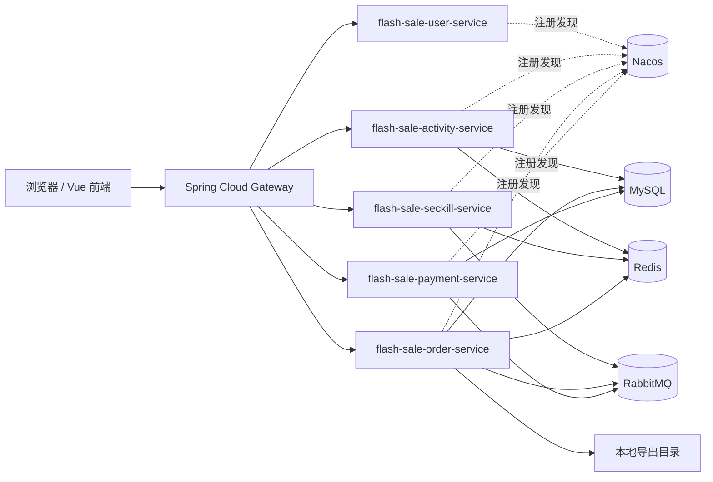

# 高并发秒杀兑换平台功能需求与技术架构文档

> 文档版本：v1.1  
> 更新日期：2026-04-27  
> 文档性质：基于当前仓库实现的功能需求与技术架构说明  
> 适用项目：`flash_sale_service`  
> 编写依据：`README.md`、`docs/后端接口文档.md`、`deploy/sql/01_schema.sql`、当前各服务与前端源码

## 1. 文档概述

### 1.1 当前项目状态

当前仓库已经完成 `Task 1 ~ Task 8` 的核心业务实现，并补充了 `Task 9` 联调与验收所需的自动化脚本、测试数据和订单查询能力。项目当前是一套面向本地单机联调的微服务实践工程，包含：

- 后端五个业务服务：用户、活动、秒杀、订单、支付。
- 一个统一入口网关：`flash-sale-gateway`。
- 一个 Vue 3 前端：包含公开活动页、用户订单页和发布方后台页面。
- 一套本地基础设施编排：MySQL、Redis、RabbitMQ、Nacos。
- 一套验收与压测脚本：用于免费链路、支付链路、导出链路和并发秒杀验证。

本文档不再按“目标设计态”描述系统，而是按“当前仓库已实现内容 + 明确预留项”来整理需求与架构。

### 1.2 建设目标

当前实现阶段的目标是：

- 提供一个统一的高并发秒杀入口，避免秒杀流量直接冲击数据库。
- 打通“活动创建 -> 发布 -> 秒杀 -> 订单 -> 支付/发码 -> 查询/导出”的完整业务闭环。
- 同时支持系统生成兑换码和第三方导入兑换码两种模式。
- 同时支持免支付活动和支付后发码活动。
- 为课程设计、个人实践、本地联调和并发验证提供可重复运行的工程基础。

### 1.3 当前交付边界

当前仓库已经实现的内容：

- 用户注册、登录、JWT 鉴权、角色透传。
- 活动创建、编辑、发布、提前发布、下线、删除、公开活动列表与详情。
- 第三方兑换码导入、导入批次查询、失败明细查询。
- 秒杀资格校验、结果轮询、Redis 预扣库存、RabbitMQ 异步建单。
- 免费活动即时发码、支付活动待支付建单、支付成功后发码、支付超时关闭。
- 当前用户订单查询、按活动查询订单、发布方按活动查询订单与兑换码。
- 导出任务创建、异步导出、文件下载、异常补偿台账记录与处理。
- 本地冒烟联调和并发压测脚本。

当前未实现或仅预留的内容：

- 真实第三方支付渠道接入。
- 独立通知服务、短信/站内信推送。
- 独立监控中心、告警平台和链路追踪系统。
- 后台完整用户管理、运营报表大盘、复杂风控能力。
- 多节点部署、高可用数据库、分布式事务治理。

### 1.4 业务角色

| 角色 | 当前职责 |
| --- | --- |
| `ADMIN` | 可访问后台接口，查看活动、订单、导出与补偿数据。 |
| `PUBLISHER` | 创建活动、导入兑换码、发布/下线活动、查看本人活动订单、创建导出任务。 |
| `USER` | 注册、登录、浏览公开活动、参与秒杀、发起模拟支付、查询个人订单与兑换码。 |
| Gateway | 统一 JWT 校验、公开路径放行、用户上下文透传。 |
| RabbitMQ / Redis / MySQL / Nacos | 作为当前本地联调基础设施支撑业务链路。 |

说明：

- 当前 `ADMIN` 与 `PUBLISHER` 共用大部分后台页面和接口，没有单独的管理员运营控制台。
- 当前没有独立“通知系统”角色，支付与发码结果主要通过查询接口与前端轮询呈现。

## 2. 当前功能需求

### 2.1 功能交付总览

| 模块 | 当前实现状态 | 说明 |
| --- | --- | --- |
| 用户认证 | 已实现 | 注册、登录、`/me`、后台按 ID 查用户。 |
| 活动管理 | 已实现 | 创建、编辑、详情、列表、发布、提前发布、下线、删除。 |
| 公开活动展示 | 已实现 | 公开活动列表、详情、前端公开页。 |
| 兑换码导入 | 已实现 | `csv/xlsx` 导入、批次记录、失败明细。 |
| 秒杀入口 | 已实现 | Redis + Lua 校验，MQ 异步建单，结果轮询。 |
| 免费活动闭环 | 已实现 | 秒杀成功后直接建单并发码。 |
| 支付活动闭环 | 已实现 | 建待支付订单、创建模拟支付单、回调成功后发码。 |
| 订单查询 | 已实现 | 我的全部订单、按活动订单、发布方按活动订单。 |
| 导出能力 | 已实现 | 异步导出 `CSV/XLSX`、下载文件。 |
| 补偿台账 | 部分实现 | 当前覆盖导出死信补偿台账，不是全链路补偿中心。 |
| 前端界面 | 已实现 | 公开页、用户订单页、发布方后台活动与订单页。 |
| 自动化验收 | 已实现 | `smoke` 冒烟联调、`load-test` 并发压测。 |

### 2.2 当前核心业务流程

#### 2.2.1 免费活动流程

1. 发布方创建活动，`needPayment=false`，可选择系统生成码或第三方导入码。
2. 若 `publishMode=IMMEDIATE`，创建成功后活动会立即发布并预热 Redis；若为 `SCHEDULED`，则等待调度器到点发布或手动提前发布。
3. 用户调用 `/api/seckill/activities/{activityId}/attempt` 发起秒杀。
4. 秒杀服务读取 Redis 中的活动快照，执行 Lua 脚本完成时间窗、库存、限购和重复请求校验。
5. 校验成功后发送 `order.create` 事件并立即返回 `SECKILL_PROCESSING`。
6. 订单服务消费消息，创建免支付订单、扣减持久化库存、分配或生成兑换码。
7. 订单服务回写 `seckill:result:{activityId}:{userId}`，用户轮询结果接口获取订单号和兑换码。

#### 2.2.2 支付活动流程

1. 发布方创建支付型活动，`needPayment=true` 且 `priceAmount > 0`。
2. 用户秒杀成功后，订单服务创建 `WAIT_PAY` 订单，并将秒杀结果写为 `PENDING_PAYMENT`。
3. 用户调用 `/api/payments/orders/{orderNo}` 创建模拟支付单。
4. 支付服务写入 `payment_record`，同时向延时队列发送 `order.timeout.close` 相关事件。
5. 用户或前端调用 `/api/payments/callback` 提交模拟支付回调。
6. 支付服务更新支付记录并发送 `payment.success` 事件。
7. 订单服务消费 `payment.success`，更新订单支付状态并完成发码。
8. 用户通过秒杀结果轮询与订单查询页查看最终结果。

#### 2.2.3 定时发布与第三方兑换码导入流程

1. 定时活动要求 `publishMode=SCHEDULED` 且 `publishTime <= startTime`。
2. 第三方导入活动在发布前必须先导入足够的兑换码。
3. 当前支持 `csv` 和 `xlsx` 两种导入格式，按首列解析兑换码。
4. 活动发布时若 `codeSourceMode=THIRD_PARTY_IMPORTED`，系统会校验可用码量是否不少于活动库存。
5. 对于定时活动，到达 `publishTime` 后由活动服务内置调度器自动发布；也可通过 `/advance-publish` 提前发布。

### 2.3 模块需求明细

#### 2.3.1 用户认证与权限

- 支持普通用户注册与登录。
- 登录成功后返回 JWT，默认有效期由 `FLASH_SALE_JWT_TTL` 控制，示例默认值为 `2h`。
- Gateway 会对非公开路径执行 Bearer Token 校验，并把 `X-User-Id`、`X-Username`、`X-Role` 透传给下游服务。
- 公开路径当前仅包括：
  - `/api/users/login`
  - `/api/users/register`
  - `/api/public/activities`
  - `/api/public/activities/**`
  - `/actuator/health`
  - `/actuator/info`
- 基于 `@RequireRole` 的 AOP 鉴权已经落地，主要用于活动后台接口、导出接口和发布方订单接口。

#### 2.3.2 活动配置、发布与公开展示

- 活动配置字段当前包括：
  - `title`
  - `description`
  - `coverUrl`
  - `totalStock`
  - `priceAmount`
  - `needPayment`
  - `purchaseLimitType`
  - `purchaseLimitCount`
  - `codeSourceMode`
  - `publishMode`
  - `publishTime`
  - `startTime`
  - `endTime`
- `publishMode=IMMEDIATE` 时，创建或编辑成功后会直接进入发布流程，不需要额外调用发布接口。
- `publishMode=SCHEDULED` 时，活动保持 `UNPUBLISHED`，等待调度器到点发布，或由发布方手动提前发布。
- 活动支持三种发布状态：`UNPUBLISHED`、`PUBLISHED`、`OFFLINE`。
- 活动支持三个业务阶段：`PREVIEW`、`ONGOING`、`ENDED`。
- 当前公开活动接口只返回 `publishStatus=PUBLISHED` 的活动。
- 当前前端后台已提供活动列表、详情、新建、编辑、发布、提前发布、下线、删除入口。

#### 2.3.3 第三方兑换码导入

- 仅 `UNPUBLISHED` 且 `codeSourceMode=THIRD_PARTY_IMPORTED` 的活动允许导码。
- 当前支持的文件类型为 `csv` 与 `xlsx`。
- 当前识别的首行表头为：
  - `code`
  - `redeem_code`
  - `兑换码`
- 解析规则为“只读取首列”。
- 当前失败原因包括：
  - `EMPTY_CODE`
  - `INVALID_FORMAT`
  - `DUPLICATE_IN_FILE`
  - `DUPLICATE_IN_SYSTEM`
  - `EXCEED_STOCK_LIMIT`
- 导入结果会写入：
  - `redeem_code`
  - `redeem_code_import_batch`
  - `redeem_code_import_fail_detail`
- 当前后台页面支持导入、查看最新批次结果、查看历史批次和失败明细。

#### 2.3.4 秒杀资格校验与结果轮询

- 秒杀接口是平台唯一高并发入口：`POST /api/seckill/activities/{activityId}/attempt`。
- 当前只有该接口强制要求 `X-Request-Id`。
- 秒杀服务不直接写 MySQL，主链路先走 Redis 和 RabbitMQ。
- 当前会返回的业务码包括：
  - `SECKILL_PROCESSING`
  - `ACTIVITY_NOT_STARTED`
  - `ACTIVITY_ENDED`
  - `ACTIVITY_OFFLINE`
  - `OUT_OF_STOCK`
  - `DUPLICATE_REQUEST`
  - `OVER_PURCHASE_LIMIT`
- 结果查询接口为 `GET /api/seckill/results/{activityId}`，返回状态包括：
  - `INIT`
  - `PROCESSING`
  - `PENDING_PAYMENT`
  - `SUCCESS`
  - `FAIL`

#### 2.3.5 订单与发码闭环

- 免费活动建单后立即发码。
- 支付活动先建待支付订单，支付成功后再发码。
- 当前订单状态、支付状态、发码状态已经分离：
  - 订单状态：`INIT`、`CONFIRMED`、`FAILED`、`CLOSED`
  - 支付状态：`NO_NEED`、`WAIT_PAY`、`PAID`、`CLOSED`
  - 发码状态：`PENDING`、`ISSUED`、`FAILED`
- `SYSTEM_GENERATED` 模式下，订单服务实时生成兑换码并落库。
- `THIRD_PARTY_IMPORTED` 模式下，订单服务从可用码池中抢占一条 `AVAILABLE` 兑换码。
- 当前已实现订单查询接口：
  - `GET /api/orders`
  - `GET /api/orders/activities/{activityId}`
  - `GET /api/orders/admin/activities/{activityId}`
- 当前未实现“按订单号查询订单详情”单独接口。

#### 2.3.6 模拟支付与超时关闭

- `POST /api/payments/orders/{orderNo}` 用于创建模拟支付单，仅允许当前登录用户为自己的 `WAIT_PAY` 订单发起支付。
- `POST /api/payments/callback` 用于模拟支付回调。
- 需要注意：
  - Payment Controller 本身没有显式读取用户上下文。
  - 但当前通过 Gateway 访问时，该路径不在公开白名单内，因此仍需要携带 Bearer Token。
- 支付服务会为每笔支付单发送一个延时消息，超时后通过死信转发为 `order.timeout.close` 事件。
- 订单服务同时保留了一个定时扫描兜底任务，默认每 `5s` 扫描一次超时待支付订单，避免仅依赖 MQ。
- 当前支付超时时间默认值为 `900000ms`，即 `15 分钟`。

#### 2.3.7 导出、补偿与审计

- 当前导出入口为 `POST /api/exports/tasks`。
- 当前支持导出格式：
  - `CSV`
  - `XLSX`
- 当前支持的筛选字段：
  - `payStatus`
  - `orderStatus`
  - `codeStatus`
  - `userId`
- 导出任务会先写入 `export_task`，再发送 `export.generate` 事件异步生成文件。
- 文件生成后会返回 `fileUrl`，下载接口为 `GET /api/exports/files/{fileName}`。
- 当前补偿台账接口包括：
  - `GET /api/exports/compensations`
  - `POST /api/exports/compensations/{compensationId}/resolve`
- 当前补偿台账只覆盖导出死信 `export.generate.dead` 场景，不代表全链路补偿中心已完成。
- 当前审计日志也主要落在导出任务创建、处理、失败、补偿处理这些动作上，并未覆盖所有后台敏感操作。

#### 2.3.8 前端页面与联调脚本

当前前端已经实现以下页面：

- 公开首页：`/public/home`
- 公开活动列表：`/public/activities`
- 公开活动详情：`/public/activities/:id`
- 登录页：`/login`
- 注册页：`/register`
- 发布方活动列表：`/admin/activities`
- 发布方活动详情：`/admin/activities/:id`
- 发布方活动创建/编辑：`/admin/activities/create`、`/admin/activities/:id/edit`
- 发布方活动订单与导出：`/admin/activities/:id/orders`
- 用户订单页：`/user/orders`

当前仓库还提供：

- `python scripts/task9/task9_acceptance.py smoke`
- `python scripts/task9/task9_acceptance.py load-test --activity-id <ID> --users <N> --concurrency <N>`

这些脚本可用于回归免费链路、支付链路、导出链路以及本地并发秒杀验证。

### 2.4 当前核心业务规则

#### 2.4.1 活动配置规则

- `needPayment=true` 时，`priceAmount` 必须大于 `0`。
- `needPayment=false` 时，`priceAmount` 必须等于 `0`。
- `startTime` 必须早于 `endTime`。
- `totalStock` 必须大于 `0`。
- `publishMode=SCHEDULED` 时必须设置 `publishTime`，且 `publishTime` 不能晚于 `startTime`。
- `codeSourceMode` 当前仅支持：
  - `SYSTEM_GENERATED`
  - `THIRD_PARTY_IMPORTED`
- `purchaseLimitType` 当前仅支持：
  - `SINGLE`
  - `MULTI`

#### 2.4.2 限购与幂等规则

- `SINGLE` 表示同一用户对同一活动只允许成功一次。
- `MULTI` 表示允许重复成功，但不能超过 `purchaseLimitCount`。
- Redis Lua 脚本一次性完成：
  - 时间窗校验
  - 库存扣减
  - 限购计数
  - 重复请求校验
- 当前秒杀请求的幂等粒度为 `activityId + userId + requestId`。
- 订单侧通过 `purchase_unique_key` 和 `order_no` 做唯一性控制。
- 支付回调侧通过 `transaction_no` 做幂等。

#### 2.4.3 发码与补偿规则

- 第三方导入码不足时：
  - 免费活动会失败并补偿库存与限购计数。
  - 支付活动在支付成功后若无法抢占可用码，会把订单标记为失败并写回失败结果。
- 系统生成码多次插入冲突或最终落库失败时，会标记为 `SYSTEM_CODE_GENERATION_FAILED`。
- 支付超时关闭时，会回补数据库库存和 Redis 限购/库存计数。
- 当前结果缓存失败文案主要包括：
  - `活动不存在`
  - `兑换码不足`
  - `系统发码失败`
  - `订单处理失败`
  - `支付超时，订单已关闭`

#### 2.4.4 当前接口与权限边界

- `X-Request-Id` 目前是推荐全局透传字段，不是所有创建类接口都强制要求。
- 仅秒杀尝试接口会在未携带 `X-Request-Id` 时直接返回 `INVALID_ARGUMENT`。
- Gateway 统一保护 `/api/activities/**`、`/api/seckill/**`、`/api/orders/**`、`/api/exports/**`、`/api/payments/**`。
- 发布方活动订单接口会额外校验：
  - `ADMIN` 可查任意活动；
  - `PUBLISHER` 只能查看自己创建的活动。

### 2.5 非功能与验收口径

| 类别 | 当前实现口径 |
| --- | --- |
| 部署形态 | 单机本地联调，非生产高可用部署。 |
| 高并发处理 | 秒杀入口走 Redis + Lua + MQ，订单和发码异步处理。 |
| 数据一致性 | Redis 预扣 + MySQL 持久化扣减 + 失败补偿，保证最终一致性。 |
| 安全性 | JWT、RBAC、统一异常返回、请求头透传用户上下文。 |
| 审计能力 | 当前已落地导出任务与补偿处理审计，不是全量审计。 |
| 监控能力 | 以日志、脚本报告、数据库台账为主，未接入完整监控系统。 |
| 联调能力 | 提供默认账号、种子数据、Docker Compose、Task 9 脚本。 |

当前验收重点建议围绕以下四条链路：

1. 免费活动：秒杀成功、订单确认、免支付、已发码。
2. 支付活动：待支付 -> 回调成功 -> 已支付 -> 已发码。
3. 导出任务：任务成功、返回下载地址、文件可下载。
4. 并发秒杀：不超卖、不重复下单、结果数量闭合。

## 3. 技术架构

### 3.1 总体架构


```mermaid
flowchart LR
    Browser[浏览器 / Vue 前端]
    Gateway[Spring Cloud Gateway]

    UserSvc[flash-sale-user-service]
    ActivitySvc[flash-sale-activity-service]
    SeckillSvc[flash-sale-seckill-service]
    OrderSvc[flash-sale-order-service]
    PaymentSvc[flash-sale-payment-service]

    Redis[(Redis)]
    MQ[(RabbitMQ)]
    MySQL[(MySQL)]
    Nacos[(Nacos)]
    Files[本地导出目录]

    Browser --> Gateway
    Gateway --> UserSvc
    Gateway --> ActivitySvc
    Gateway --> SeckillSvc
    Gateway --> OrderSvc
    Gateway --> PaymentSvc

    ActivitySvc --> MySQL
    ActivitySvc --> Redis
    SeckillSvc --> Redis
    SeckillSvc --> MQ
    OrderSvc --> MySQL
    OrderSvc --> Redis
    OrderSvc --> MQ
    OrderSvc --> Files
    PaymentSvc --> MySQL
    PaymentSvc --> MQ

    UserSvc -.注册发现.-> Nacos
    ActivitySvc -.注册发现.-> Nacos
    SeckillSvc -.注册发现.-> Nacos
    OrderSvc -.注册发现.-> Nacos
    PaymentSvc -.注册发现.-> Nacos
```

### 3.2 项目模块划分

| 模块 | 作用 |
| --- | --- |
| `flash-sale-gateway` | 统一入口、JWT 校验、请求头透传。 |
| `flash-sale-user-service` | 注册、登录、用户资料查询。 |
| `flash-sale-activity-service` | 活动配置、发布、缓存预热、公开活动、兑换码导入。 |
| `flash-sale-seckill-service` | 秒杀尝试、结果查询、Redis Lua、高并发入口。 |
| `flash-sale-order-service` | 建单、发码、订单查询、导出、补偿台账。 |
| `flash-sale-payment-service` | 模拟支付单、支付回调、延时关单事件。 |
| `flash-sale-common/common-core` | 统一 `ApiResponse` 等公共基础类。 |
| `flash-sale-common/common-security` | JWT、`UserContext`、RBAC 切面。 |
| `flash-sale-common/common-redis` | Redis Key 约定。 |
| `flash-sale-common/common-mq` | MQ 领域事件模型与自动配置。 |
| `flash-sale-common/common-web` | 全局异常处理等 Web 公共配置。 |
| `frontend` | Vue 3 + Vite + Pinia + Element Plus 前端界面。 |
| `deploy` | Docker Compose 与数据库初始化脚本。 |
| `scripts/task9` | 联调、验收与压测脚本。 |

### 3.3 技术选型

| 分类 | 技术 | 当前用途 |
| --- | --- | --- |
| 后端框架 | Spring Boot 3.2.4 | 服务基础框架。 |
| 微服务体系 | Spring Cloud 2023 + Spring Cloud Alibaba 2023 | Gateway、服务注册发现。 |
| 服务注册 | Nacos | 供 Gateway 通过 `lb://` 方式路由。 |
| 数据访问 | MyBatis Plus | 活动、订单、支付、导出等数据持久化。 |
| 数据库 | MySQL 8.0 | 核心业务数据落库。 |
| 缓存 | Redis 7.x | 活动快照、库存、限购、结果缓存。 |
| 消息队列 | RabbitMQ 3.x | 建单、支付成功、超时关闭、导出。 |
| Excel 导出 | EasyExcel | `XLSX` 导出。 |
| 前端 | Vue 3 + Vite + TypeScript | 页面交互与后台管理界面。 |
| 前端状态/路由 | Pinia + Vue Router | 登录态、路由守卫。 |
| 前端组件 | Element Plus + lucide-vue-next | 表格、表单、反馈、图标。 |
| 容器编排 | Docker Compose | 本地基础设施启动。 |
| 自动化脚本 | Python 3 | Task 9 冒烟与压测。 |

说明：

- 当前仓库没有实际使用 OpenFeign，同步调用能力主要未展开，不应再把它视为当前已落地选型。

### 3.4 服务职责

| 服务 | 当前职责 | 备注 |
| --- | --- | --- |
| 用户服务 | 注册、登录、当前用户信息、后台按 ID 查用户 | 不含完整后台用户管理。 |
| 活动服务 | 活动 CRUD、发布/提前发布/下线/删除、公开活动查询、兑换码导入 | 含定时发布调度器。 |
| 秒杀服务 | 秒杀资格校验、结果查询、发送 `order.create` 事件 | 不直接写 MySQL。 |
| 订单服务 | 免支付建单发码、待支付建单、支付成功后发码、订单查询、导出、补偿记录 | 同时有超时关单扫描兜底。 |
| 支付服务 | 创建模拟支付单、处理模拟回调、发送支付成功和超时关闭相关消息 | 不直接发码。 |

### 3.5 网关、鉴权与统一响应

- Gateway 路由前缀当前为：
  - `/api/users/**`
  - `/api/activities/**`
  - `/api/public/activities/**`
  - `/api/seckill/**`
  - `/api/orders/**`
  - `/api/exports/**`
  - `/api/payments/**`
- Gateway 使用 `JwtAuthenticationFilter` 作为全局过滤器，校验成功后透传：
  - `X-User-Id`
  - `X-Username`
  - `X-Role`
- 下游服务统一使用 `ApiResponse` 结构：

```json
{
  "code": "SUCCESS",
  "message": "ok",
  "requestId": "REQ-20260427-001",
  "data": {}
}
```

- 统一异常由 `GlobalExceptionHandler` 处理，当前主要业务码为：
  - `INVALID_ARGUMENT`
  - `UNAUTHORIZED`
  - `FORBIDDEN`
  - `SYSTEM_ERROR`

### 3.6 异步消息架构

#### 3.6.1 交换机与队列

| 类型 | 名称 | 用途 |
| --- | --- | --- |
| Topic Exchange | `flash.sale.event.exchange` | 主业务事件交换机。 |
| Queue | `flash.sale.order.create.queue` | 消费 `order.create` 建单事件。 |
| Queue | `flash.sale.payment.success.queue` | 消费 `payment.success` 支付成功事件。 |
| Queue | `flash.sale.order.timeout.close.queue` | 消费 `order.timeout.close` 超时关单事件。 |
| Queue | `flash.sale.export.generate.queue` | 消费 `export.generate` 导出任务。 |
| Queue | `flash.sale.export.generate.dead.queue` | 消费 `export.generate.dead` 导出死信记录。 |
| Delay Queue | `flash.sale.order.timeout.delay.queue` | 支付服务投递延时消息，死信转发为 `order.timeout.close`。 |

#### 3.6.2 当前事件类型

| 事件类型 | 发送方 | 消费方 | 说明 |
| --- | --- | --- | --- |
| `order.create` | 秒杀服务 | 订单服务 | 秒杀通过后异步建单。 |
| `payment.success` | 支付服务 | 订单服务 | 支付成功后更新订单并发码。 |
| `order.timeout.close` | 支付服务延时队列 / 订单服务兜底扫描 | 订单服务 | 关闭超时待支付订单并补偿。 |
| `export.generate` | 订单服务 | 订单服务 | 异步生成导出文件。 |
| `export.generate.dead` | 订单服务 | 订单服务 | 记录导出死信到补偿台账。 |

#### 3.6.3 事件模型

当前统一事件模型 `DomainEvent<T>` 包含以下字段：

- `messageId`
- `eventType`
- `bizKey`
- `occurTime`
- `payload`

### 3.7 Redis 与缓存设计

#### 3.7.1 Redis Key 约定

| Key | 类型 | 当前用途 |
| --- | --- | --- |
| `seckill:stock:{activityId}` | String | 秒杀可售库存。 |
| `seckill:limit:{activityId}:{userId}` | String | 用户已使用的限购计数。 |
| `seckill:req:{activityId}:{userId}:{requestId}` | String | 请求幂等与重复请求标记。 |
| `seckill:result:{activityId}:{userId}` | Hash | 秒杀结果缓存。 |
| `activity:detail:{activityId}` | Hash | 秒杀链路活动快照。 |
| `activity:visible:list` | ZSet | 活动可见索引，当前已预热但公开列表接口尚未直接读取。 |

#### 3.7.2 当前缓存策略

- 活动发布时由活动服务预热：
  - 库存 Key
  - 活动详情 Hash
  - 可见活动 ZSet
- TTL 当前按“活动结束时间 + 24 小时”计算，若已过期则兜底 `1 小时`。
- 秒杀去重请求标记 TTL 当前为 `10 分钟`。
- 公开活动列表与详情接口当前仍主要查 MySQL，不是纯 Redis 读模型。

### 3.8 数据架构

#### 3.8.1 核心数据表

| 数据表 | 作用 | 关键字段 |
| --- | --- | --- |
| `user` | 用户信息 | `username`、`password_hash`、`role`、`status` |
| `activity_product` | 活动商品 | `total_stock`、`available_stock`、`need_payment`、`code_source_mode`、`publish_mode`、`publish_status` |
| `redeem_code` | 兑换码 | `code`、`source_type`、`batch_no`、`status`、`assigned_order_id` |
| `redeem_code_import_batch` | 导入批次 | `batch_no`、`file_name`、`success_count`、`failed_count` |
| `redeem_code_import_fail_detail` | 导入失败明细 | `batch_no`、`line_no`、`raw_code`、`failure_reason` |
| `order_record` | 订单 | `order_no`、`request_id`、`purchase_unique_key`、`order_status`、`pay_status`、`code_status` |
| `payment_record` | 支付记录 | `order_no`、`transaction_no`、`pay_status`、`callback_payload` |
| `export_task` | 导出任务 | `activity_id`、`operator_id`、`format`、`status`、`file_url` |
| `audit_log` | 审计日志 | `biz_type`、`biz_key`、`operation`、`detail_json` |
| `compensation_record` | 补偿台账 | `biz_type`、`biz_key`、`source_event`、`status`、`resolution_note` |

#### 3.8.2 当前实体关系

- 一个用户可创建多个活动。
- 一个用户可参与多个订单。
- 一个活动可关联多个订单和多条兑换码。
- 一个订单最多关联一条实际发放兑换码。
- 一个活动可对应多个导出任务。

### 3.9 接口架构

#### 3.9.1 路由前缀

| 路由前缀 | 目标服务 |
| --- | --- |
| `/api/users/**` | 用户服务 |
| `/api/activities/**` | 活动服务 |
| `/api/public/activities/**` | 活动服务 |
| `/api/seckill/**` | 秒杀服务 |
| `/api/orders/**` | 订单服务 |
| `/api/exports/**` | 订单服务 |
| `/api/payments/**` | 支付服务 |

#### 3.9.2 当前关键接口

| 方法 | 路径 | 说明 |
| --- | --- | --- |
| `POST` | `/api/users/register` | 用户注册 |
| `POST` | `/api/users/login` | 用户登录 |
| `GET` | `/api/users/me` | 查询当前用户 |
| `POST` | `/api/activities` | 创建活动 |
| `PUT` | `/api/activities/{activityId}` | 编辑活动 |
| `POST` | `/api/activities/{activityId}/publish` | 发布活动 |
| `POST` | `/api/activities/{activityId}/advance-publish` | 提前发布定时活动 |
| `POST` | `/api/activities/{activityId}/offline` | 下线活动 |
| `DELETE` | `/api/activities/{activityId}` | 删除活动 |
| `POST` | `/api/activities/{activityId}/codes/import` | 导入兑换码 |
| `GET` | `/api/public/activities` | 公开活动列表 |
| `GET` | `/api/public/activities/{activityId}` | 公开活动详情 |
| `POST` | `/api/seckill/activities/{activityId}/attempt` | 秒杀尝试 |
| `GET` | `/api/seckill/results/{activityId}` | 秒杀结果查询 |
| `GET` | `/api/orders` | 当前用户全部订单 |
| `GET` | `/api/orders/activities/{activityId}` | 当前用户活动订单 |
| `GET` | `/api/orders/admin/activities/{activityId}` | 发布方活动订单 |
| `POST` | `/api/payments/orders/{orderNo}` | 创建模拟支付单 |
| `POST` | `/api/payments/callback` | 模拟支付回调 |
| `POST` | `/api/exports/tasks` | 创建导出任务 |
| `GET` | `/api/exports/tasks/{taskId}` | 查询导出任务详情 |
| `GET` | `/api/exports/files/{fileName}` | 下载导出文件 |

详细请求与响应样例以 `docs/后端接口文档.md` 为准。

### 3.10 部署架构与端口

#### 3.10.1 当前本地部署形态

当前项目按单机联调方式部署：

| 部署单元 | 默认实例数 |
| --- | --- |
| Gateway | 1 |
| User Service | 1 |
| Activity Service | 1 |
| Seckill Service | 1 |
| Order Service | 1 |
| Payment Service | 1 |
| MySQL | 1 |
| Redis | 1 |
| RabbitMQ | 1 |
| Nacos | 1 |

#### 3.10.2 服务端口

| 组件 | 默认端口 |
| --- | --- |
| Gateway | `18080` |
| User Service | `9001` |
| Activity Service | `9002` |
| Seckill Service | `9003` |
| Order Service | `9004` |
| Payment Service | `9005` |
| Nacos | `8848` |

#### 3.10.3 基础设施端口说明

项目端口由 `.env` / `.env.example` 驱动，推荐联调口径如下：

| 组件 | 推荐默认值 |
| --- | --- |
| MySQL | `3307` |
| Redis | `6379` |
| RabbitMQ AMQP | `5672` |
| RabbitMQ Console | `15672` |

补充说明：

- `deploy/docker-compose.yml` 中 RabbitMQ 的宿主机端口带有 `${RABBITMQ_PORT:-6672}` 的兜底值。
- 因此如果未提供 `.env`，Compose fallback 口径会把 RabbitMQ 暴露到 `6672`；如果使用仓库示例 `.env.example`，则默认是 `5672`。
- Gateway 当前通过 `lb://` 路由微服务，本地联调时需要开启 Nacos 服务注册发现。

## 4. 当前风险与后续演进

### 4.1 当前风险

- 当前是单机联调架构，任一基础设施组件故障都会影响主链路。
- 真实支付、真实通知、统一监控尚未接入，当前主要依赖日志和脚本验证。
- `activity:visible:list` 已预热但公开活动接口尚未真正走该缓存索引，公开读链路仍偏数据库查询。
- 审计与补偿能力当前主要落在导出链路，订单、支付等链路尚未形成统一补偿中心。
- 支付回调在 Gateway 层仍受 JWT 保护，这对“外部第三方主动回调”场景并不合适，后续接入真实支付时必须调整。

### 4.2 建议的下一步演进

1. 增加订单/支付链路的统一补偿记录与人工处理入口。
2. 调整支付回调的网关白名单与签名校验方案，为真实支付接入做准备。
3. 把公开活动读链路逐步切到 Redis 可见活动索引与详情缓存。
4. 增加更完整的后台运营能力，包括用户管理、订单筛选、活动统计和监控大盘。
5. 在多实例部署场景下补充幂等、重试、消息积压和分布式锁策略。

## 5. 结论

当前 `flash_sale_service` 已经形成一套可运行、可联调、可压测的高并发秒杀兑换平台实践工程。其核心技术路线是：

- Gateway + JWT 做统一接入与权限控制；
- Redis + Lua 承接高并发秒杀资格校验；
- RabbitMQ 做异步建单、支付成功、超时关闭和导出削峰；
- MySQL 做订单、活动、支付、兑换码与补偿台账持久化；
- Vue 3 前端提供公开页、用户页和发布方后台操作界面；
- Python 验收脚本支撑本地烟测与并发验证。

该版本已经满足“本地单机完成活动发布、秒杀、支付、发码、导出闭环”的目标，但仍需在真实支付接入、监控告警、统一补偿和生产级高可用方面继续演进。
